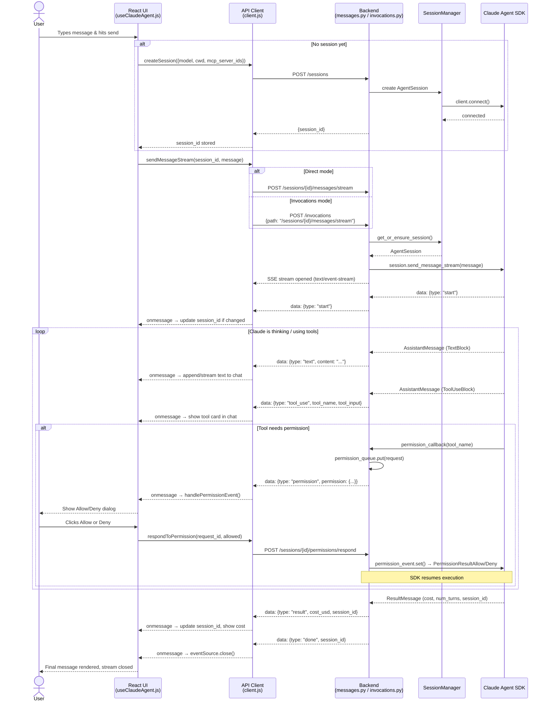

# Streaming Flow Diagram

End-to-end sequence of a user message through the Claude Agent web client stack.

## Key behaviours

- **Session is created lazily** — only on the first message if none exists
- **SSE stream stays open** for the entire duration of Claude's response, including multiple tool calls
- **Permission is an interrupt** — the stream keeps the connection alive while waiting for user input via a separate POST
- **Session ID can change** — the SDK assigns a real ID on first use; the frontend watches `start`, `result`, and `done` events to update it
